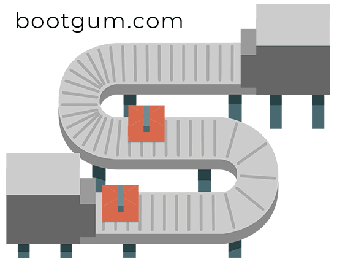

<h1 align="center">
  
</h1>

---

# ProductionTime
## Petit résumé

- Le temp mis pour la préparation d'un colis est maintenant un facteur clé pour la compréhension de la durée de reception d'un colis et de l'optimisation de la chaine de production.

## Objectifs

- Création des features manquantes
- Prédire le nombre de jour pour la préparation d'un colis
- Optimiser le temp de préparation d'un colis.

## Techno

- Python
- Jupyter

## Auteur

- [@Pierre](https://github.com/Pierre-Portfolio)
